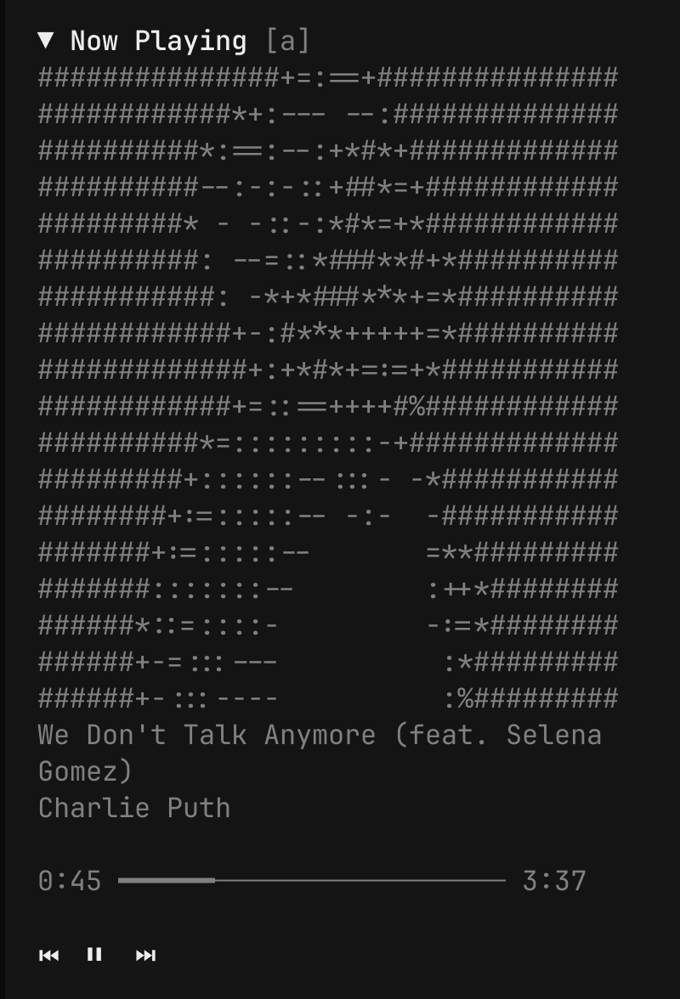

# Now Playing

OpenCode TUI plugin that shows your currently playing track in the sidebar. Supports Apple Music and Spotify.



## Features

- Shows now-playing info (track, artist, album) from Apple Music or Spotify
- Collapsible UI — click `▶`/`▼` to hide/show the entire plugin block
- Album art rendered as ASCII in the sidebar via Python + Pillow (click `[a]` to toggle)
- Progress bar with elapsed/total time
- Playback controls (⏮ play/pause ⏭)
- 2-second polling for smooth progress updates
- Prefers actively playing app when both are running
- Caches album art per track (only re-converts on track change)

## Requirements

- macOS with Apple Music or Spotify
- [OpenCode](https://opencode.ai) ≥ 1.1.2 with TUI enabled
- Python 3 with [Pillow](https://python-pillow.org/) (`pip3 install Pillow`)

## Installation

```sh
opencode plugin add now-playing
```

Or add manually to `~/.config/opencode/tui.json`:

```json
{
  "plugin": ["file:///path/to/now-playing/plugin.tsx"]
}
```

## How it works

Uses `osascript` (JXA) to query Music.app and Spotify simultaneously. If one app is actively playing while the other is paused, the playing app takes priority. Album art is extracted via AppleScript (Music) or downloaded via `curl` (Spotify), then converted to grayscale ASCII using Python Pillow.

## License

MIT
